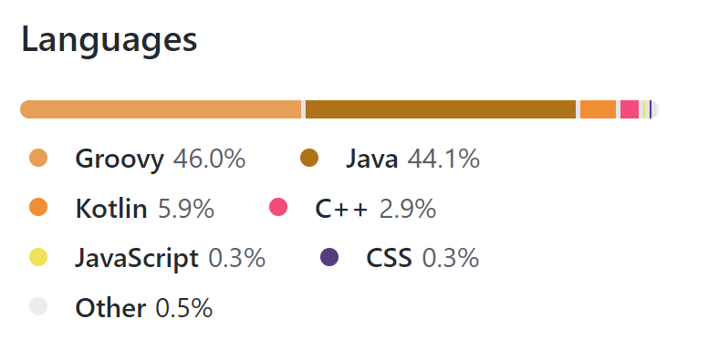
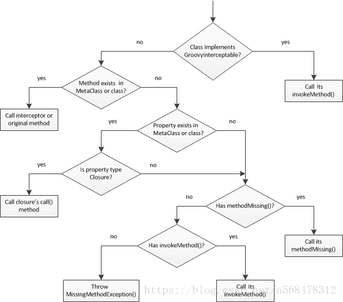

# Gradle 起底 第一篇

本文是针对的群体使用过Gradle的一些年轻人哈，看了之后，耗子尾汁。

[TOC]

gradle 的源代码地址 https://github.com/gradle/gradle 我们可以看到gradle的源码里（基于 gradle 大版本的 version 6）java 占比44% groovy 占比46%, 源码里面大部分的核心代码核心模块都是java 语言编写,test 代码主要是由groovy语言编写。

## 目录结构
往往高端的代码都以一种朴素的呈现方式，以gradle-6.3-all 为例, 解压之后目录结构如下：
~~~
***bin
*****gradle(unix and linux 启动脚本)
*****gradle.bat(windows 启动脚本)
***docs
***init.d(自定义的init.gradle 位置)
***lib(编译好的jar包)
***src(源码)
**LICENSE
**NOTICE
**README
~~~

启动Gradle就是从bin 目录下的启动脚本文件触发到lib目录下的jar里的某个java的main函数。以gradle.bat 为例, 其中最终调用的位置如下：入口类是org.gradle.launcher.GradleMain。

"%JAVA_EXE%" %DEFAULT_JVM_OPTS% %JAVA_OPTS% %GRADLE_OPTS% "-Dorg.gradle.appname=%APP_BASE_NAME%" -classpath "%CLASSPATH%" org.gradle.launcher.GradleMain %CMD_LINE_ARGS%

如果我们这个时候继续跟着这个GradleMain深入阅读的话，快放弃这个牛(愚)逼(蠢)的决定。因为代码的细节对于入门Gradle的同学来说就像马老师的打五鞭一样，没有一定的内力，一般人是看不懂。

## Gradle 脚本文件
那我们继续换个方向来再去观察 Gradle 吧。".gradle" 文件是一个很好的入手点：
~~~groovy
apply plugin: 'java'

...
dependencies {
    compile 'org.codehaus.groovy:groovy-all:2.3.11'
  ...
}
~~~

 看到这个文件很熟悉但是肯定有很多疑问，比如 plugins{xxx} 干什么了，谁来编译它或者解释它给机器呢等等，为了能解答这个问题，需要好好了解一下groovy。我们从很多地方都能知道".gradle" 文件其实就是groovy的的脚本文件。在这里我简单的以java程序员可以理解的方式解释一下plugins{}, 在gradle代码中有一个地方有一个java函数它的名字是plugins, 它的参数是一个闭包：
~~~
  public void plugins(Closure<?> closure){

  }
~~~
 什么是闭包请找代驾：http://groovy-lang.org/closures.html 

我要强调一点哈，Groovy 是基于JVM, 所以呢， 我们的这个脚本文件也是会像java文件一样被编译成.class 文件， 然后被加到jvm虚拟机里运行。
所以我们就可以从网络上继续获取groovy 脚本的运行原理, 以及groovy 作为DSL的支柱: 元对象协议（Meta Object Protocol）简称MOP, 基于这个协议就有了运行时和编译时的两种 metaprogramming, 细节和干货都在这个链接里面 http://groovy-lang.org/metaprogramming.html。

如果上面的链接你都看完了, 那你的英语应该过了六级。回正题，我们要了解".gradle"文件的运行。我先把脚本文件编译出来的class 文件show 出来。
~~~
....
public class build_xxxx extends ProjectScript{
....
     public Object run()
    {
        CallSite acallsite[] = $getCallSiteArray();
        acallsite[0].callCurrent(this,ScriptBytecodeAdapter.createMap(new Object[] {
            "plugin", "java"
        }));
       ...
    }

    private static void $createCallSiteArray_1(String as[])
    {
        as[0] = "apply";
        ...
    }

    private static CallSite[] $getCallSiteArray()
    {
      ...
        callsitearray = $createCallSiteArray_1(s);
      ...
        return callsitearray.array;
    }

}
~~~
熟悉groovy script 脚本的同学大概就知道，这个脚本的run方法是运行的入口, 通过我们上边所提到过的MOP, 就把脚本的编译和方法的调用分开了(这里用到的是的运行时的metaprogramming), 简单描述就是编译的时候脚本文件只要符合groovy 或者java语法要求, 而函数的具体实现在编译期是不需要知道的，只是记录函数的名字和参数，在运行的时候根据特定的查找顺序去寻找方法的调用, 没图没真相， 上图：

### Gradle 脚本的编译与调用时机
在上面我们简单的过了一下脚本的一些信息吧， 现在肯定有同学会觉得更加疑问， 这个脚本是谁去编程class的， 是谁？？？站出来， OK， 首先当然是你的电脑，并且也是你正在运行的Gradle去编译的, Gradle 运行之后不久就会查找settings.gradle,  然后通过settings.gradle
里的project的配置去一一查找并且编译那些build.gradle 文件, 对于'apply from : "xx.gradle"' 串联的脚本文件, 是在执行到 apply 这个方法的时候去查找并且编译的。这里我就直接先给出Gradle 源码里的相关类：DefaultScriptCompilationHandler.java 以及一个代码片段吧：当然首先要澄清一下这里省略了很多逻辑, 比如buildScript{} 代码块里的代码会先于普通代码的编译，以及gradle的编译缓存机制（就是没改变的不会再次编译）。
~~~
 private void compileScript(ScriptSource source, ClassLoader classLoader, CompilerConfiguration configuration, File metadataDir,
                               final CompileOperation<?> extractingTransformer, final Action<? super ClassNode> customVerifier) {
      ...
        GroovyClassLoader groovyClassLoader = new GroovyClassLoader(classLoader, configuration, false) ...

        groovyClassLoader.setResourceLoader(NO_OP_GROOVY_RESOURCE_LOADER);
        String scriptText = source.getResource().getText();
        String scriptName = source.getClassName();
        GroovyCodeSource codeSource = new GroovyCodeSource(scriptText == null ? "" : scriptText, scriptName, "/groovy/script");
        try {
            try {
                groovyClassLoader.parseClass(codeSource, false);

           ...
    }
~~~ 
groovyClassLoader.parseClass 这个怎么生成class, 不是本文的范畴。编译好的class文件会放在.gradle\caches\版本号\scripts-remapped 目录下。
关于调用时机，先关的类先放出来：DefaultScriptRunnerFactory.java。
~~~
            ...
            T script = getScript();
            script.init(target, scriptServices);
            Thread.currentThread().setContextClassLoader(script.getContextClassloader());
            script.getStandardOutputCapture().start();
            try {
                script.run();
            } catch (Throwable e) {
            ...
~~~
边(编)玩(完)就run, 果然比较牛逼：如下图。
~~~
 ...
            //Pass 2, compile everything except buildscript {}, pluginManagement{}, and plugin requests, then run
            final ScriptTarget scriptTarget = secondPassTarget(target);
            scriptType = scriptTarget.getScriptClass();

            CompileOperation<BuildScriptData> operation = compileOperationFactory.getScriptCompileOperation(scriptSource, scriptTarget);

            final ScriptRunner<? extends BasicScript, BuildScriptData> runner = compiler.compile(scriptType, operation, targetScope, ClosureCreationInterceptingVerifier.INSTANCE);
            if (scriptTarget.getSupportsMethodInheritance() && runner.getHasMethods()) {
                scriptTarget.attachScript(runner.getScript());
            }
            if (!runner.getRunDoesSomething()) {
                return;
            }

            Runnable buildScriptRunner = () -> runner.run(target, services);

~~~
### Gradle 脚本的函数的调用
在上面的某个地方我应该提到过MOP, Groovy 拥有一套查找机制, 当然仅仅凭借这一点的灵活性完全无法满足Gradle 那些优(变)雅(态)的需求。所以Gradle源码又创建了DynamicObject所引申出来的一套函数和属性的查找机制。有点复杂我会在后面续的文章里讲解。如果你等待不急的话也可以从我基于Gradle思想，所创建的一个log 分析项目的源代码看看：https://github.com/tianxunaicaoke/LogSpin , 毕竟我的代码(需)比(要)Gradle(你)的(来)源(点)码(亮)简(星)单(星)多了。
