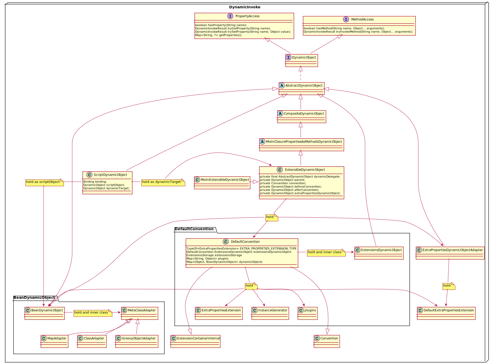

# Gradle 入门 第二篇

没有正确的选择， 所以我们只能努力把自己的选择变得正确。

## Gradle 脚本的函数的调用
接着上一篇文章的尾巴，现在需要在详细一点考虑函数的调用。这里所说的函数调用是指 '.gradle' 里的那些函数调用是怎么在Gradle映射到方法的实现。

DynamicObject 接口位于Gradle源码里的 core-api 模块：
~~~
public interface DynamicObject extends MethodAccess, PropertyAccess {
    /**
     * Creates a {@link MissingPropertyException} for getting an unknown property of this object.
     */
    MissingPropertyException getMissingProperty(String name);

    /**
     * Creates a {@link MissingPropertyException} for setting an unknown property of this object.
     */
    MissingPropertyException setMissingProperty(String name);

    /**
     * Creates a {@link MissingMethodException} for invoking an unknown method on this object.
     */
    MissingMethodException methodMissingException(String name, Object... params);

    /**
     * Don't use this method. Use the overload {@link #tryGetProperty(String)} instead.
     */
    Object getProperty(String name) throws MissingPropertyException;

    /**
     * Don't use this method. Use the overload {@link #trySetProperty(String, Object)} instead.
     */
    void setProperty(String name, Object value) throws MissingPropertyException;

    /**
     * Don't use this method. Use the overload {@link MethodAccess#tryInvokeMethod(String, Object...)} instead.
     */
    Object invokeMethod(String name, Object... arguments) throws MissingMethodException;
}
~~~
AbstractDynamicObject 继承自DynamicObject，它是 Gradle 脚本函数调用的关键。画个简单的图来表示一下：

图2-1 流程图

当 Gradle 扫描了项目工程获得setting.gradle 文件，识别出所有 project (root project and subproject) 并且在 Gradle runtime 中创建对应DefaultProject 之后，便加载这些 project 对应的 Gradle 脚本文件，接着编译成 class(XXScript)，如上图所示，Gradle runtime 会调用 XXScript.run() 方法。在这里有一步操作是比较关键并且在 run 方法之前运行，就是把 DefaultProject 传给 XXScript。而DefaultProject 会在后面 DynamicInvoke System 里用到。

这里的 xxScript 就是前文中的 "build_xxxx extends ProjectScript" 忘记的可以回顾一下上一篇文章。

Groovy 的 RuntimeMateProgramma 机制会把方法调用映射到 invokeMethod 上，在这里的 invokeMethod 在xxScript 的基类 BaseScript 中。如图2-1 所示接下来就会通过 invokeMethod 方法进入 DynamicInvoke System 世界的大门，高潮来了。

## 动态调用系统 
先把这个系统大概的类图勾勒一下，其中重点关注一下图2-1中所示的 ScriptDynamicObject、BeanDynamicObject、以及 ExtensibleDynamicObject。

图2-2 类图

上面提到过的 invokeMethod 方法的具体实现如下：
~~~
public abstract class BasicScript extends Script implements .. {
    private ScriptDynamicObject dynamicObject = new ScriptDynamicObject(this);
    ...
    public Object invokeMethod(String name, Object args) {
        return dynamicObject.invokeMethod(name, (Object[]) args);
    }
}
~~~
其中参数 name 是真正想要调用的方法名称，参数 args 是方法对应的参数。这里我们可以举个栗子：
~~~
 apply plugin:"java"
 // apply 是函数名字， 参数是一个 map 类型，key 是 plugin ， Value 是"java".
~~~

dynamicObject.invokeMethod 调用的是 ScriptDynamicObject 方法的 invokeMethod ，ScriptDynamicObject 的 invokeMethod 方法实现在基类
AbstractDynamicObject, 如下所示：

~~~
AbstractDynamicObject

public Object invokeMethod(String name, Object... arguments) ..{
        DynamicInvokeResult result = tryInvokeMethod(name, arguments);
       ...
    }
~~~
接着 invokeMethod 继续调用了 ScriptDynamicObject 的 tryInvokeMethod ，如下所示：

~~~
public DynamicInvokeResult tryInvokeMethod(String name, Object... arguments) {
            DynamicInvokeResult result = scriptObject.tryInvokeMethod(name, arguments);
            if (result.isFound()) {
                return result;
            }
            return dynamicTarget.tryInvokeMethod(name, arguments);
        }
~~~

ScriptDynamicObject 顾名思义是将 XXScript invokeMethod 方法动态转移。在其内部又有两个动态代理其中 scriptObject 是 BeanDynamicObject, dynamicTarget 就是上面提到的 DefaultProject 里的 ExtensibleDynamicObject。从 tryInvokeMethod 方法中可以看到，先通过 BeanDynamicObject 代理去找方法调用(也就是找 apply 真正实现的地方)，如果没有找到，就会去在 dynamicTarger 中寻找。

~~~
private static final class ScriptDynamicObject extends AbstractDynamicObject {

        ...
        private final DynamicObject scriptObject;
        private DynamicObject dynamicTarget;

        ScriptDynamicObject(BasicScript script) {
            ...
            scriptObject = new BeanDynamicObject(script).withNotImplementsMissing();
            dynamicTarget = scriptObject;
        }

        public void setTarget(Object target) {
            dynamicTarget = DynamicObjectUtil.asDynamicObject(target);
        }
        ...
}
~~~

这里简单的描述一下 BeanDynamicObject 的作用是使用常规反射来提供对bean的属性和方法的访问，这句解释是摘自 BeanDynamicObject 的类文档，言简意赅，在这里就是把 XXScript 包装了一下。 所以用上面的举的栗子，通过反射尝试访问 XXScript 里的 apply 方法， 在XXScript 类的基类 ProjectScript 里刚好拥有 apply 方法。所以栗子里的方法找到了实现的地方。
~~~
public abstract class ProjectScript extends PluginsAwareScript {

    public void apply(Closure closure) {
        getScriptTarget().apply(closure);
    }

    ...
    public void apply(Map options) {
        getScriptTarget().apply(options);
    }
    ...
}
~~~

我们再举一个栗子：dependencies 的方法查找。

~~~
apply plugin:"java"

 dependencies {
       ...
 }

~~~

在 XXScript 以及它的基类里面并没有 dependencies 这个方法，所以根据上面的逻辑，Gradle 会转到 dynamicTarget(ExtensibleDynamicObject) 中寻找。

这里需要停一下，分析一下 ExtensibleDynamicObject 这个类，在这个类中有一段函数：
~~~
 private void updateDelegates() {
        DynamicObject[] delegates = new DynamicObject[6];
        delegates[0] = dynamicDelegate;
        delegates[1] = extraPropertiesDynamicObject;
        int idx = 2;
        if (beforeConvention != null) {
            delegates[idx++] = beforeConvention;
        }
        if (convention != null) {
            delegates[idx++] = convention.getExtensionsAsDynamicObject();
        }
        if (afterConvention != null) {
            delegates[idx++] = afterConvention;
        }
        boolean addedParent = false;
        if (parent != null) {
            addedParent = true;
            delegates[idx++] = parent;
        }
        DynamicObject[] objects = new DynamicObject[idx];
        System.arraycopy(delegates, 0, objects, 0, idx);
        setObjects(objects);

        if (addedParent) {
            idx--;
            objects = new DynamicObject[idx];
            System.arraycopy(delegates, 0, objects, 0, idx);
            setObjectsForUpdate(objects);
        }
    }
~~~
DynamicObject[] delegates = new DynamicObject[6]; 意思是指 ExtensibleDynamicObject 有6个方法的 Delegate，查找方法的调用最终会按顺序在这6个 Delegate 中去寻找。在这里我先引用一下官网的上的一个小节：
https://docs.gradle.org/current/dsl/org.gradle.api.Project.html#N15050 
~~~
A project has 5 method 'scopes', which it searches for methods:

1. The Project object itself.
2. The build file. The project searches for a matching method declared in the build file.
3. The extensions added to the project by the plugins. Each extension is available as a method which takes a closure or Action as a parameter.
The convention methods added to the project by the plugins. A plugin can add properties and method to a project through the project's Convention object.
4. The tasks of the project. A method is added for each task, using the name of the task as the method name and taking a single closure or Action parameter. The method calls the Task.configure(groovy.lang.Closure) method for the associated task with the provided closure. For example, if the project has a task called compile, then a method is added with the following signature: void compile(Closure configureClosure).
5. The methods of the parent project, recursively up to the root project.
A property of the project whose value is a closure. The closure is treated as a method and called with the provided parameters. The property is located as described above.
~~~
这里我觉得官网上的文档有点欠妥，从我们上面的分析，The build file. The project searches for a matching method declared in the build file. 应该是在 The Project object itself 之前。

转回话题，我们来观察一下 ExtensibleDynamicObject 的构造函数：
~~~
public ExtensibleDynamicObject(Object delegate, Class<?> publicType, InstanceGenerator instanceGenerator) {
        this(delegate, createDynamicObject(delegate, publicType), new DefaultConvention(instanceGenerator));
    }

    ...
    public ExtensibleDynamicObject(Object delegate, AbstractDynamicObject dynamicDelegate, Convention convention) {
        this.dynamicDelegate = dynamicDelegate;
        this.convention = convention;
        this.extraPropertiesDynamicObject = new ExtraPropertiesDynamicObjectAdapter(delegate.getClass(), convention.getExtraProperties());

        updateDelegates();
    }

     private static BeanDynamicObject createDynamicObject(Object delegate, Class<?> publicType) {
        return new BeanDynamicObject(delegate, publicType);
    }
~~~
同时还有 new 它的地方：
~~~
 class DefaultProject ...{

             extensibleDynamicObject = new ExtensibleDynamicObject(this, Project.class, services.get(InstantiatorFactory.class).decorateLenient(services));

 }
~~~
综上所得，dynamicDelegate 就是 BeanDynamicObject 把 DefaultProject 包了一层，结合上面提到过的内容，dependencies 方法是需要在 DefaultProject 中寻找，结果如下：
~~~
 class DefaultProject ...{
    ...
    @Override
    public void dependencies(Closure configureClosure) {
        ConfigureUtil.configure(configureClosure, getDependencies());
    }
    ...
 }
 
~~~

看到这里，是不是会比较清晰一些，这里调用的 configure 函数，就是去配置 dependency 的入口，我会再后面的章节继续带着大家深入阅读的，现在就先止步于这个地方。
下一章节会继续上面的话题，以及如何使用 Plugin、Convention 等来扩展函数的调用映射。有篇幅的话还会介绍 NamedDomainObject 相关一些知识。敬请期待。。。