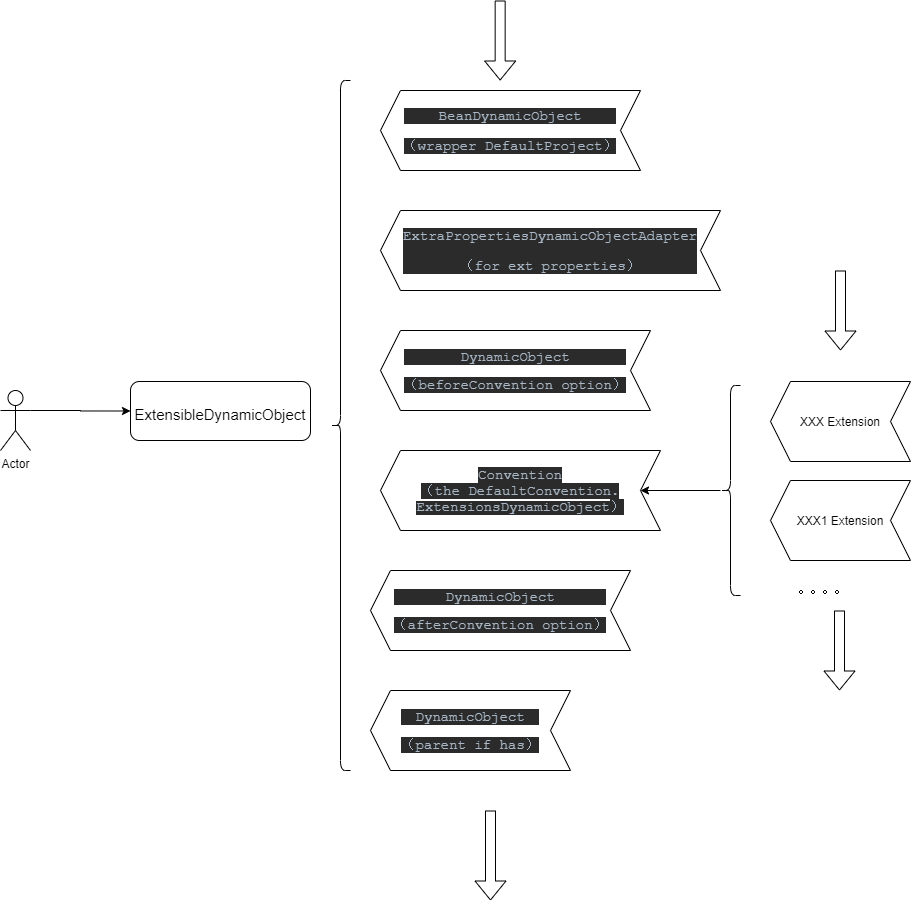

# Gradle 入门 第三篇

破山中贼易，破心中贼难

## Gradle Convention and Extension
接着上文所说的 DynamicSystem，这一节会进而引入 Convention and Extension 的概念，继续扩展整个系统的灵活性，在 Gradle 的 api 官网里有直接介绍 Extension 相关的 https://docs.gradle.org/current/dsl/org.gradle.api.plugins.ExtensionAware.html，
但是没有讲解关于 Convention 相关的。
Convention 的字面意思是指约定，而 Extension 的字面意思是扩展，从 Gradle 源码来看，Gradle 把这两者变成了一个有机的结合。节选 DefaultProject 类里的一段源码：

~~~
    @Override
    public ExtensionContainerInternal getExtensions() {
        return (ExtensionContainerInternal) getConvention();
    }
~~~
可以看到其实外部 get 到的 Extension 其实就是 Convention，我对于这段代码的理解是：只要对内满足一定的约定，可以被 Gradle 系统识别的一些 code，其实就是对整个系统的一种扩展。
这个是怎么用的呢，我在这里节选一段 JavaBasePlugin 的代码一作试例：
~~~
 private JavaPluginConvention addExtensions(final ProjectInternal project) {
        ...
        project.getConvention().getPlugins().put("java", javaConvention);
        project.getExtensions().create(JavaPluginExtension.class, "java", DefaultJavaPluginExtension.class, javaConvention, project, jvmPluginServices, toolchainSpec);
        project.getExtensions().add(JavaInstallationRegistry.class, "javaInstalls", javaInstallationRegistry);
        project.getExtensions().create(JavaToolchainService.class, "javaToolchains", DefaultJavaToolchainService.class, getJavaToolchainQueryService());
        return javaConvention;
    }
~~~
我们看到 JavaBasePlugin 通过添加了一些 Extensions 扩展了 Gradle。

在继续介绍之前我先把先关的两个接口展示一下：
~~~
/**
 * Allows adding 'namespaced' DSL extensions to a target object.
 */
public interface ExtensionContainer {
   <T> void add(Class<T> publicType, String name, T extension);
   ...
   void add(String name, Object extension);
   <T> T create(Class<T> publicType, String name, Class<? extends T> instanceType, Object... constructionArguments);
   ...
}

/**
 * 
A {@code Convention} manages a set of <i>convention objects</i>. When you add a convention object to a {@code
 * Convention}, and the properties and methods of the convention object become available as properties and methods of
 * the object which the convention is associated to. A convention object is simply a POJO or POGO. Usually, a {@code
 * Convention} is used by plugins to extend a {@link org.gradle.api.Project} or a {@link org.gradle.api.Task}.

 */
public interface Convention extends ExtensionContainer {
    
    Map<String, Object> getPlugins();
    
    <T> T getPlugin(Class<T> type) throws IllegalStateException;

    <T> T findPlugin(Class<T> type) throws IllegalStateException;

    DynamicObject getExtensionsAsDynamicObject();
}
~~~

从 Convention 接口的注解中可以看出，Convention 管理了一系列的 convention object，当一个 convention object 加入一个 Convention , convention object 的属性和方法调用就可以作用于 Convention 的属性和方法调用。这个 convention object 可以是 POJO 或者是 POGO，其中 POJO(Plain Old Java Object) 指的是普通的Java对象，可以使用 Java 或 JVM 上的其他语言来创建。POGO(Plain Old Groovy Object) 是用 Groovy 编写的对象，扩展了java.lang.Object，同时也实现了groovy.lang.GroovyObject接口。
在上一篇文章中，介绍了 dynamicTarget(ExtensibleDynamicObject)，如果有不了解的同学可以转到上一篇文章中查看。我们再展示一下相关的代码：
~~~
public class ExtensibleDynamicObject extends MixInClosurePropertiesAsMethodsDynamicObject implements HasConvention {

   public ExtensibleDynamicObject(Object delegate, Class<?> publicType, InstanceGenerator instanceGenerator) {
        this(delegate, createDynamicObject(delegate, publicType), new DefaultConvention(instanceGenerator));
    }

    public ExtensibleDynamicObject(Object delegate, AbstractDynamicObject dynamicDelegate, InstanceGenerator instanceGenerator) {
        this(delegate, dynamicDelegate, new DefaultConvention(instanceGenerator));
    }

    public ExtensibleDynamicObject(Object delegate, AbstractDynamicObject dynamicDelegate, Convention convention) {
        this.dynamicDelegate = dynamicDelegate;
        this.convention = convention;
        this.extraPropertiesDynamicObject = new ExtraPropertiesDynamicObjectAdapter(delegate.getClass(), convention.getExtraProperties());

        updateDelegates();
    }

    private Convention convention;
    ...
    @Override
    public Convention getConvention() {
        return convention;
    }
    ...
~~~
其中 Convention 的具体实现是 DefaultConvention，在 ExtensibleDynamicObject 构造方法中被 new 出来。
~~~
public class DefaultConvention implements Convention, ExtensionContainerInternal {
    private final ExtensionsStorage extensionsStorage = new ExtensionsStorage();

    ...

     @Override
    public <T> void add(TypeOf<T> publicType, String name, T extension) {
        extensionsStorage.add(publicType, name, extension);
    }

    ...
    private class ExtensionsDynamicObject extends AbstractDynamicObject {
        @Override
        public String getDisplayName() {
            return "extensions";
        }
    }
}
~~~
这里一定要注意 ExtensibleDynamicObject 有两个，一个是之前一直提到的，还有一个就是在 DefaultConvention 内部的存在一个内部类 DefaultConvention.ExtensibleDynamicObject。

## Plugin 的扩展

先以一张图来承上启下：

在第二篇文章中，函数的查找只停留在图中的 ExtensibleDynamicObject，这里我来展开了在  ExtensibleDynamicObject 里的方法查找流，如果在其中某一个环节找到了方法的调用，则停止继续寻找。

其中 ExtensibleDynamicObject 的调用逻辑在其基类 CompositeDynamicObject 中，如下所示：
~~~
 @Override
    public DynamicInvokeResult tryInvokeMethod(String name, Object... arguments) {
        for (DynamicObject object : objects) {
            DynamicInvokeResult result = object.tryInvokeMethod(name, arguments);
            if (result.isFound()) {
                return result;
            }
        }
        return DynamicInvokeResult.notFound();
    }
~~~
objects 里存的就是我们上图所画的第一列。当遍历到 Convent 时候，会跳转到 DefaultConvention.ExtensibleDynamicObject, 代码如下：
~~~
        @Override
        public DynamicInvokeResult tryInvokeMethod(String name, Object... args) {
            if (isConfigureExtensionMethod(name, args)) {
                return DynamicInvokeResult.found(configureExtension(name, args));
            }
            if (plugins == null) {
                return DynamicInvokeResult.notFound();
            }
            for (Object object : plugins.values()) {
                BeanDynamicObject dynamicObject = asDynamicObject(object).withNotImplementsMissing();
                DynamicInvokeResult result = dynamicObject.tryInvokeMethod(name, args);
                if (result.isFound()) {
                    return result;
                }
            }
            return DynamicInvokeResult.notFound();
        }

    private boolean isConfigureExtensionMethod(String name, Object[] args) {
        return args.length == 1 && args[0] instanceof Closure && extensionsStorage.hasExtension(name);
    }

    private Object configureExtension(String name, Object[] args) {
        Closure closure = (Closure) args[0];
        Action<Object> action = ConfigureUtil.configureUsing(closure);
        return extensionsStorage.configureExtension(name, action);
    }
~~~
首先会判断 isConfigureExtensionMethod ，我们可以看到 ConfigureExtensionMethod 其实满足有且只有一个 closure 的参数的方法，并且这个方法可以在 extensionsStorage 中存在，也就是在上图的第二列。如果满足上述要求，那么就会用 closure 去配置这个 extension。
这里举个简单的例子方便理解，我们经常会看到这样的代码。
~~~
plugins {
    id 'com.android.application'
}

android {
    compileSdkVersion 29
    buildToolsVersion "30.0.2"

    defaultConfig {
        applicationId "com.example.myapplication"
        minSdkVersion 25
        targetSdkVersion 29
        versionCode 1
        versionName "1.0"

        testInstrumentationRunner "androidx.test.runner.AndroidJUnitRunner"
    }
}
~~~
在 apply 了 com.android.application plugin 之后，会以"android" 为名字，把一个 BaseExtension 加入 Project 中的 Convention， 所以当脚本运行到 android{} 时，就是用{}里的闭包来配置 BaseExtension。