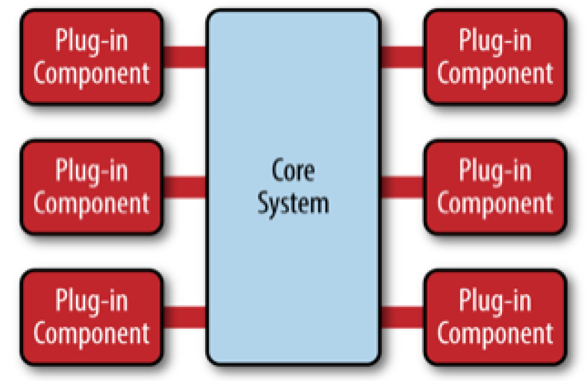
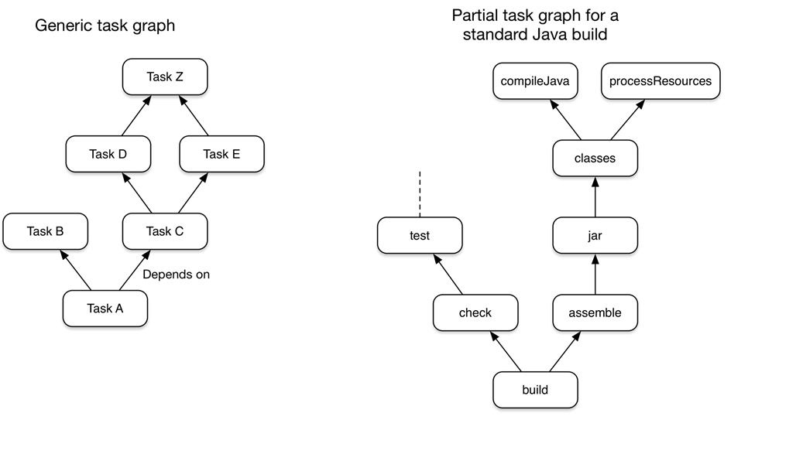

# Gradle 进阶 第四篇

天行健，君子以自强不息
## 微内核架构
前面的几篇文章，从 Gradle 脚本的函数调用一个侧面来了解认识了一下 Gradle，主要是因为 Gradle 脚本经常会让入门的同学觉得抽象异常。

这篇文章又回到一个最初点，我们从骨架结构的角度来再次了解一下它，首先我要介绍一种叫做微内核的代码架构模型。相信很多人都使用过这种架构。《Software Architecture Patterns》https://www.oreilly.com/library/view/software-architecture-patterns/9781491971437/ 是 O'REILLY 提供的一本免费的架构入门的书籍，讲解了五中比较通用软件架构模型，其中就有微内核的讲解。我在这里就简单解释一下，更多的是与 Gradle 源码结合。首先上一幅图：

摘自书中的一段介绍，"微内核架构的核⼼心系统⼀一般情况下只包含⼀一个能够使系统运作起来的最⼩小化模块。很多操作系统的实现就是
使⽤用微内核架构，因此这也是该架构名字的由来。从商业应⽤用的⾓角度看，核⼼心系统通常是为特定的使⽤用场
景、规则、或者复杂条件处理定义了通⽤用的业务逻辑，⽽而插件模块根据这些规则实现了具体的业务逻辑"。映射到 Gradle 中，Core System 就是 Gradle 的基本系统，包括系统函数动态调用，包括配置管理，包括插件的管理等等。那些 Plugin Component 包括 Gradle 内置的那些基于 JVM 等的 Plugin，同时也包括那些第三方提供的 plugin，其中比较著名的就是 Android gradle plugin。插件和系统如何连接是一个比较重要的环节，不同项目有不同实现，但是最基本的一点，插件需要满足一定的约定，对于系统来说，插件是透明的，系统是不需要知道细节的，但是插件提供了系统所定制的一些抽象实现，让系统在无感的情况下扩展了能力。所以一个好的设计就非常重要。以 Gradle 为例子，它设计了抽象的 Configuration 以供 plugin 来管理依赖，抽象的 Convention&Extension 以供 plugin 来配置自身，抽象的 task 以供 plugin 来提供一些特有的处理流程。
而 Gradle 本身会把一次项目的构建分散成多个阶段，首先我们前文有提到过的，脚本的查找，编译，执行，在执行解析阶段又会涉及到一些相应 Project 的配置，比如 Project 所 apply 的所有 Plugin 需要配置，根据上述的结果以及脚本自定义的一些步骤，再创建并配置 task，当所有的 task 都以及创建完成，就会通过之前配置的或者默认的一些规则，把这些 task 连接成有向无环图（DGA），最后一步就是按需运行这些 task，截一张官方的图。

## Gradle 的微内核
这里我节选一些代码片段来一窥全貌。

~~~
 private enum Stage {
        LoadSettings, Configure, TaskGraph, RunTasks() {
            @Override
            String getDisplayName() {
                return "Build";
            }
        }, Finished;

        String getDisplayName() {
            return name();
        }
    }
~~~

在 DefaultGradleLauncher 中有一个 Stage 的 enum，其中包括了 LoadSettings，Configure，TaskGraph，RunTask，Finished 几个阶段。

~~~
 private void doClassicBuildStages(Stage upTo) {
        if (stage == null) {
            instantExecution.prepareForBuildLogicExecution();
        }
        prepareSettings();
        if (upTo == Stage.LoadSettings) {
            return;
        }
        prepareProjects();
        if (upTo == Stage.Configure) {
            return;
        }
        prepareTaskExecution();
        if (upTo == Stage.TaskGraph) {
            return;
        }
        instantExecution.saveScheduledWork();
        runWork();
    }
~~~

doClassicBuildStages 是 DefaultGradleLauncher 的一个方法，大致展示了经典的 build 阶段。
如果 Gradle 脚本里 apply 了插件，就会调用相应插件的 apply 方法。这里用 JavaBasePlugin 为例，展示了 apply 方法。
~~~
public class JavaBasePlugin implements Plugin<Project> {
  ...
  @Override
    public void apply(final Project project) {
        ProjectInternal projectInternal = (ProjectInternal) project;

        project.getPluginManager().apply(BasePlugin.class);
        project.getPluginManager().apply(JvmEcosystemPlugin.class);
        project.getPluginManager().apply(ReportingBasePlugin.class);

        JavaPluginConvention javaConvention = addExtensions(projectInternal);

        configureSourceSetDefaults(javaConvention);
        configureCompileDefaults(project, javaConvention);

        configureJavaDoc(project, javaConvention);
        configureTest(project, javaConvention);
        configureBuildNeeded(project);
        configureBuildDependents(project);
        bridgeToSoftwareModelIfNecessary(projectInternal);
    }

    private JavaPluginConvention addExtensions(final ProjectInternal project) {
        DefaultToolchainSpec toolchainSpec = project.getObjects().newInstance(DefaultToolchainSpec.class);
        SourceSetContainer sourceSets = (SourceSetContainer) project.getExtensions().getByName("sourceSets");
        JavaPluginConvention javaConvention = new DefaultJavaPluginConvention(project, sourceSets, toolchainSpec);
        project.getConvention().getPlugins().put("java", javaConvention);
        project.getExtensions().create(JavaPluginExtension.class, "java", DefaultJavaPluginExtension.class, javaConvention, project, jvmPluginServices, toolchainSpec);
        project.getExtensions().add(JavaInstallationRegistry.class, "javaInstalls", javaInstallationRegistry);
        project.getExtensions().create(JavaToolchainService.class, "javaToolchains", DefaultJavaToolchainService.class, getJavaToolchainQueryService());
        return javaConvention;
    }
  ...

}
~~~
首先 JavaBasePlugin 会持有传入的 Project，并 apply 了 BasePlugin、JvmEcosystemPlugin、ReportingBasePlugin，接着生成 JavaConvention 用来让外界配置 Plugin。这个 Plugin 是如何被调用到 apply 方法，会在下一小节讲解。
这里要注意在 apply 方法里有调用 configureSourceSetDefaults，展示如下：
~~~
    private void configureSourceSetDefaults(final JavaPluginConvention pluginConvention) {
    ...
      TaskProvider<JavaCompile> compileTask = createCompileJavaTask(sourceSet, sourceSet.getJava(), project);
            createClassesTask(sourceSet, project);
    ...
    }
~~~
这些 Task 就是 Plugin 在 apply 的时候添加的，会 hook 在 Gradle 的生命周期的 task 上， 这个也比较好理解，就是我在上面所说的， Task 最终会连接在一起，形成数个 DGA，连接在 Gradle 生命周期的 Task 上，才能保证在生命周期里运行，否则就需要以 Task 的name 单独运行。关于 Gradle 中的 Plugin 是如何关联到系统的，我会在下一篇文章中讲述，敬请关注。
