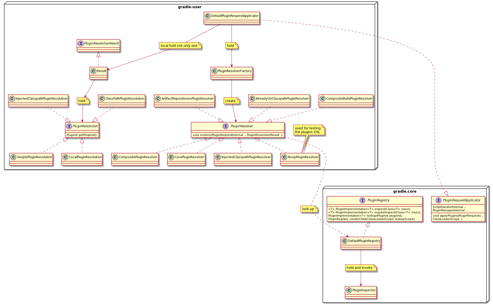

# Gradle 进阶 第五篇

虽千万人，吾往矣

## Plugin 应用

接着上一节所讲的微内核架构，系统的 Plugin 管理简单的实现方式就是通过在系统内部实现一个注册表，用来获取 Plugin，并且得到 Plugin 的可用性。
下面来从源码展开了解一下 Gradle plugin 的管理。在源码的110多个模块中，plugin 管理先关的有三个，分别是 gradle.plugin-development、gradle.plugins、以及 gradle.plugin-user。
其中 gradle.plugin-development 是关于支持开发 plugin 的模块，
在后面“如何设计 Plugin”中将会详细讲解。这里举个简单例子：JavaGradlePluginPlugin，它就是我们平常写 plugin 时需要 apply 的 plugin，摘个官网的例子：
~~~
plugins {
    id 'java-gradle-plugin'
}

gradlePlugin {
    plugins {
        simplePlugin {
            id = 'org.samples.greeting'
            implementationClass = 'org.gradle.GreetingPlugin'
        }
    }
}
~~~
gradle.plugins 模块中定义了大部分的内置 Plugins，这里就一句带过，后文会有一系列专门的文章来介绍一些特别的 Plugin。
本文的重点是系统如何管理 plugin，也就是模块 gradle.plugin-user的主要功能。
一般在 Gradle 的使用中，apply 一个 plugin 都是通过在脚本文件中声明来完成的，就如同上面的代码片中所示，apply 了"java-gradle-plugin"。Gradle 也提供了通过 java 代码来 apply 一个 plugin，代码如下：
~~~
 //invoke side
 project.getPluginManager().apply(BasePlugin.class);
~~~

~~~
 ==========================
// in DefaultPluginManager
    public void apply(String pluginId) {
        PluginImplementation<?> plugin = pluginRegistry.lookup(DefaultPluginId.unvalidated(pluginId));
        if (plugin == null) {
            throw new UnknownPluginException("Plugin with id '" + pluginId + "' not found.");
        }
        doApply(plugin);
    }

~~~
除了和 Gradle 一起发布的内部 plugin 之外，我们也可自定义一些本地的 Plugin，或者使用一些远程的第三方 plugin。

> 1. 应用 buildSrc 目录下的 Plugin
> 2. 应用脚本里直接编写的 Plugin
> 3. 应用本地/远程仓库里的 Plugin

这里就不做详细的demo，下面分析源码的时候会有提及。

## plugin 查找
之前的一篇文章中讲解了有关 Gradle 脚本的编译过程，其中有一个细节省略未说，就是在编译每一个 .gradle 文件的时候都会分为两部分，如果脚本文件里有 buildscript{} 代码块，就会先编译 buildscript{} 里的代码、或者 apply xxx ，或者plugins{} 为一个 class，编译完成之后直接运行，接着编译剩下的代码为一个 class，再运行。
举个简单的例子：
~~~
// case 1
plugins {
    id 'com.android.application'
}
======= 分割线 ======
android {
    compileSdkVersion 30
    buildToolsVersion "30.0.2"

    defaultConfig {
      ...
    }
}
~~~

~~~
// case 2
buildscript {
    repositories {
        google()
        jcenter()
    }
    dependencies {
        classpath "com.android.tools.build:gradle:4.1.0"
    }
}
======= 分割线 ======
allprojects {
    repositories {
        google()
        jcenter()
    }
}

task clean(type: Delete) {
    delete rootProject.buildDir
}
~~~
在分割线之上的会先编译，并且运行，之后编译分割线之下的部分，再运行。其中 plugins {} 的代码块就是用来声明所需要的 Plugin 的一个Request。Gradle 会根据这个 PluginRequest 去查找需要加载的 plugin。

这里需要注意一点，case 2 中的 classpath "com.android.tools.build:gradle:4.1.0"，已经将 android plugin 加入了 dependencies 中，Gradle 就会去指定的仓库中去下载相应的插件版本并且加入 ClassPath 的 scorp 中。所以对于"应用本地/远程仓库里的 Plugin"，都需要 buildscript 的 dependencies 中声明。

关于 Gradle 是如何通过脚本把 Plugin 加入 Runtime，我先上一幅类图，作以梳理：

在 DefaultScriptPluginFactory 类中：
~~~
            // Pass 1, extract plugin requests and plugin repositories and execute buildscript {}, ignoring (i.e. not even compiling) anything else

            CompileOperation<?> initialOperation = compileOperationFactory.getPluginsBlockCompileOperation(initialPassScriptTarget);
            Class<? extends BasicScript> scriptType = initialPassScriptTarget.getScriptClass();
            ScriptRunner<? extends BasicScript, ?> initialRunner = compiler.compile(scriptType, initialOperation, baseScope, Actions.doNothing());
            initialRunner.run(target, services);

            PluginRequests initialPluginRequests = getInitialPluginRequests(initialRunner);
            PluginRequests mergedPluginRequests = autoAppliedPluginHandler.mergeWithAutoAppliedPlugins(initialPluginRequests, target);

            PluginManagerInternal pluginManager = topLevelScript ? initialPassScriptTarget.getPluginManager() : null;
            pluginRequestApplicator.applyPlugins(mergedPluginRequests, scriptHandler, pluginManager, targetScope);

~~~
其中 getInitialPluginRequests 就是获得脚本里的 Plugin 请求，plugins { id 'com.android.application' }，接着合并完所有的 Plugin 请求之后调用 applyPlugins 方法去解析 Plugin 请求。