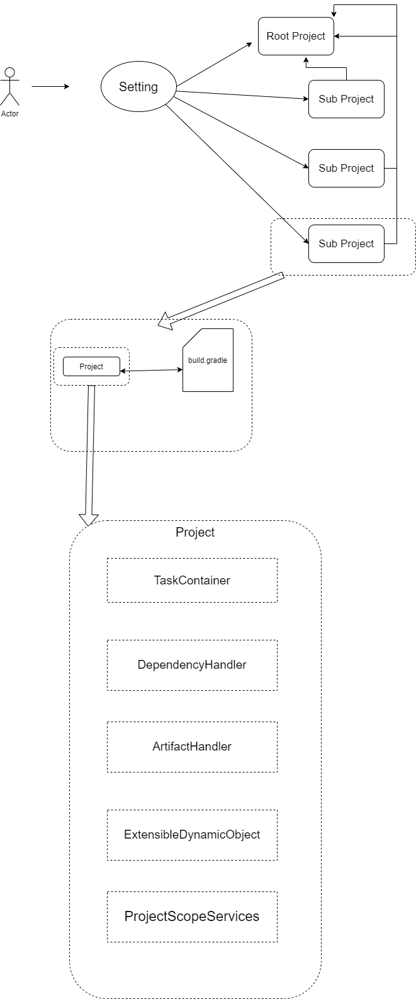

# Gradle 进阶 第七篇

锲而不舍，金石可镂

## Gradle Project 上卷
Gradle Project 对应一个模块，对于一个多模块构建的项目，它会有 RootProject，和所有 SubProject。这些都是在 setting.gradle 中配置的：
~~~
include ':lib'
include ':app'
rootProject.name = "GradleDebug"
~~~
Project 的实现类是 DefaultProject。创建它的类是 ProjectFactory。在解析完 setting 文件之后便创建了所有的 Project，并且把 RootProject 设置成为所有 SubProject 的 Parent。创建代码如下。
~~~
 @Override
    public DefaultProject createProject(GradleInternal gradle, ProjectDescriptor projectDescriptor, ProjectInternal parent, ClassLoaderScope selfClassLoaderScope, ClassLoaderScope baseClassLoaderScope) {
        File buildFile = projectDescriptor.getBuildFile();
        TextResource resource = textFileResourceLoader.loadFile("build file", buildFile);
        ScriptSource source = new TextResourceScriptSource(resource);
        DefaultProject project = instantiator.newInstance(DefaultProject.class,
                projectDescriptor.getName(),
                parent,
                projectDescriptor.getProjectDir(),
                buildFile,
                source,
                gradle,
                gradle.getServiceRegistryFactory(),
                selfClassLoaderScope,
                baseClassLoaderScope
        );
        project.beforeEvaluate(new Action<Project>() {
            @Override
            public void execute(Project project) {
                NameValidator.validate(project.getName(), "project name", DefaultProjectDescriptor.INVALID_NAME_IN_INCLUDE_HINT);
            }
        });

        if (parent != null) {
            parent.addChildProject(project);
        }
        projectRegistry.addProject(project);

        return project;
    }
~~~
TextResource resource = textFileResourceLoader.loadFile("build file", buildFile); 表示在创建 DefaultProject 的时候需要获得 build.gradle 文件。最终把生成的 DefaultProject 文件加入到注册表中。在这里需要注意一点，Project 的创建早于对应的 "build.gradle" 的编译。
DefaultProject 中维护了许多重要的成员变量。这里展示出部分，并通过讲解这些成员变量来剖析一下 Project 扮演的角色。这里我放一张图来加深理解：

~~~

    private TaskContainerInternal taskContainer;

    private DependencyHandler dependencyHandler;

    private ConfigurationContainer configurationContainer;

    private ArtifactHandler artifactHandler;

    private ExtensibleDynamicObject extensibleDynamicObject;
 ~~~

## TaskContainer

TaskContainer 主要作用是管理一些列的 Task，TaskContainer 本身是一个接口，同时继承了 NamedDomainObjectCollection 接口，TaskContainerInternal 也是一个接口，继承了 TaskContainer，真正的实现类是 DefaultTaskContainer。
~~~
public class DefaultTaskContainer extends DefaultTaskCollection<Task> implements TaskContainerInternal {

private Task doCreate(Map<String, ?> options, final Action<? super Task> configureAction) {
    ...
}

private <T extends Task> T doCreate(final String name, final Class<T> type, @Nullable final Object[] constructorArgs, final Action<? super T> configureAction) throws InvalidUserDataException {
    ...
}

}
~~~
Task 的创建就是通过这两个重要的方法创建的，后面的 Task 章节会详细的讲解。这里会简单用个例子来作一个引子：
~~~
task clean(type: Delete) {
    delete rootProject.buildDir
}
~~~
在 Gradle 的脚本文件中，直接调用 task 函数来创建。上述例子编译成的.class 文件，用IJ Ide 打开，有这么一段：
~~~
         acallsite[1].callCurrent(this, ScriptBytecodeAdapter.createMap(new Object[] {
            "type", org/gradle/api/tasks/Delete
        }), "clean", new _run_closure2(this, this))
~~~
其中 acallsite[1] 是 "task"，结合我们在第二篇文章里的方法查找机制，这个方法最终映射到 DefaultProject 的下面这个方法上：
~~~
    @Override
    public Task task(Map options, String task, Closure configureClosure) {
        return taskContainer.create(addMaps(options, singletonMap(Task.TASK_NAME, task))).configure(configureClosure);
    }    
~~~
这里的 taskContainer 的 create 最终调用上面所说的 doCreate.
~~~
    @Override
    public Task create(Map<String, ?> options) {
        assertMutable("create(Map<String, ?>)");
        return doCreate(options, Actions.doNothing());
    }
~~~
这里需要注意一点 { delete rootProject.buildDir } 这个 closure 的作用是为了配置创建出来的 Task。细节同样在后续 Task 章节里讲解。
在 doCreate 中会把创建好的 task 加入集合中，同时也会根据设置 task 的一些属性来配置相关依赖等等。
## DependencyHandler 
DependencyHandler 的工作主要是帮助 Project 来管理依赖，DefaultDependencyHandler 实现了 DependencyHandler 的接口，DefaultDependencyHandler 是抽象类，Gradle 会在运行时通过 ASM 创建DefaultDependencyHandler_Decorated 类，并实例化。这块细节也会在后面的一章讲解。
这里举一个栗子，我们经常会为项目添加依赖，在 Gradle 脚本文件中往往是下面这种形式：
~~~
dependencies {
    implementation 'com.android.tools.build:gradle:3.1.0'
    implementation 'androidx.appcompat:appcompat:1.2.0'
    implementation 'com.google.android.material:material:1.2.1'
    implementation 'androidx.constraintlayout:constraintlayout:2.0.4'
    testImplementation 'junit:junit:4.+'
    androidTestImplementation 'androidx.test.ext:junit:1.1.2'
    androidTestImplementation 'androidx.test.espresso:espresso-core:3.3.0'
}
~~~
这个方法映射到 DefaultProject 里的方法：
~~~
    @Override
    public void dependencies(Closure configureClosure) {
        ConfigureUtil.configure(configureClosure, getDependencies());
    } 
~~~
其中 getDependencies() 返回的便是 DependencyHandler。这里需要讲的一点是，在 dependencies 代码块里面的 implementation 'com.android.tools.build:gradle:3.1.0' 实际上是一个函数调用，函数名称是 implementation，参数是 'com.android.tools.build:gradle:3.1.0'，同时需要注意一点，这里的函数名其实是和 Configuration 对应的。

但是事实上，DefaultDependencyHandler(_Decorated) 中并没有类似于 'implementaion' 这样的函数，我在前文讲过 BeanDynamicObject，BeanDynamicObject 的作用是使用常规反射来提供对bean的属性和方法的访问，这里的 bean 就是 DefaultDependencyHandler(_Decorated)，Gradel 在没有直接找到方法调用时，还会有一些备用逻辑，如下：
~~~
        if (bean instanceof MethodMixIn) {
            // If implements MethodMixIn, do not attempt to locate opaque method, as this is expensive
            MethodMixIn methodMixIn = (MethodMixIn) bean;
            return methodMixIn.getAdditionalMethods().tryInvokeMethod(name, arguments);
        }
~~~
对于 MethodMixIn 类型的 bean，会调用 getAdditionalMethods() 来继续查找。
~~~
    public MethodAccess getAdditionalMethods() {
        return dynamicMethods;
    }
    ...
    dynamicMethods = new DynamicAddDependencyMethods(configurationContainer, new DirectDependencyAdder());

~~~ 
DefaultDependencyHandler(_Decorated) 继承自 MethodMixIn 接口，提供的额外的方法搜索路径 DynamicAddDependencyMethods。
~~~
class DynamicAddDependencyMethods implements MethodAccess {
    ...

    @Override
    public boolean hasMethod(String name, Object... arguments) {
        return arguments.length != 0 && configurationContainer.findByName(name) != null;
    }

    @Override
    public DynamicInvokeResult tryInvokeMethod(String name, Object... arguments) {
        if (arguments.length == 0) {
            return DynamicInvokeResult.notFound();
        }
        Configuration configuration = configurationContainer.findByName(name);
        if (configuration == null) {
            return DynamicInvokeResult.notFound();
        }

        List<?> normalizedArgs = CollectionUtils.flattenCollections(arguments);
        if (normalizedArgs.size() == 2 && normalizedArgs.get(1) instanceof Closure) {
            return DynamicInvokeResult.found(dependencyAdder.add(configuration, normalizedArgs.get(0), (Closure) normalizedArgs.get(1)));
        } else if (normalizedArgs.size() == 1) {
            return DynamicInvokeResult.found(dependencyAdder.add(configuration, normalizedArgs.get(0), null));
        } else {
            for (Object arg : normalizedArgs) {
                dependencyAdder.add(configuration, arg, null);
            }
            return DynamicInvokeResult.found();
        }
    }
    ...
}
~~~
可以看到在 tryInvokeMethod 方法里实际上通过 configurationContainer，来找到和调用函数名相同的 Configuration。然后通过 dependencyAdder 的add 方法调用到 DefaultDependencyHandler 中的 doAdd 方法。
~~~
     private Dependency doAdd(Configuration configuration, Object dependencyNotation, @Nullable Closure configureClosure) {
        if (dependencyNotation instanceof Configuration) {
            DeprecationLogger.deprecateBehaviour("Adding a Configuration as a dependency is a confusing behavior which isn't recommended.")
                .withAdvice("If you're interested in inheriting the dependencies from the Configuration you are adding, you should use Configuration#extendsFrom instead.")
                .willBeRemovedInGradle8()
                .withDslReference(Configuration.class, "extendsFrom(org.gradle.api.artifacts.Configuration[])")
                .nagUser();
            return doAddConfiguration(configuration, (Configuration) dependencyNotation);
        }
        if (dependencyNotation instanceof Provider<?>) {
            return doAddProvider(configuration, (Provider<?>) dependencyNotation, configureClosure);
        } else {
            return doAddRegularDependency(configuration, dependencyNotation, configureClosure);
        }
    }
~~~
后续的如何解析依赖，以及依赖冲突解决等等问题，在后面会详细讲解。
## ConfigurationContaine
在上面讲 DependencyHandler 一节中提到了 ConfigurationContainer。它是一个接口，继承自 NamedDomainObjectContainer 接口，什么是 NamedDomainObjectContainer，举个栗子：
~~~
 configurations {
    // declare a "configuration" named "someConfiguration"
    someConfiguration
 }
 dependencies {
    // add a project dependency to the "someConfiguration" configuration
    someConfiguration project(":lib")
}
~~~
就是用户可以在集合中自定义一些对象，而这些对象可以被加入 Gradle 动态系统。再举一个栗子，buildTypes 就提供用户创建各种各样的 BuildType：
~~~
   buildTypes {
        release {
            minifyEnabled false
            proguardFiles getDefaultProguardFile('proguard-android-optimize.txt'), 'proguard-rules.pro'
        }
        debug{

        }
        xxx{
            minifyEnabled true
            proguardFiles getDefaultProguardFile('proguard-android-optimize.txt'), 'proguard-rules.pro'  
        }
    }
~~~
Gradle 是如何实现这个功能的，我会在后面的文章单独来讲解。回到正题，这里的 ConfigurationContaine 是管理构建时的 Configuration。

以下是官网解释什么是 Configuration：
> Every dependency declared for a Gradle project applies to a specific scope. For example some dependencies should be used for compiling source code whereas others only need to be available at runtime. Gradle represents the scope of a dependency with the help of a Configuration. Every configuration can be identified by a unique name.

> 为Gradle项目声明的每个依赖项都应用于特定范围。例如，某些依赖项应该用于编译源代码，而其他依赖项只需要在运行时可用。Gradle在配置的帮助下表示依赖关系的范围。每个配置都可以用一个唯一的名称来标识。

贴一张官网的图：

<image src="Configurations.png" />

