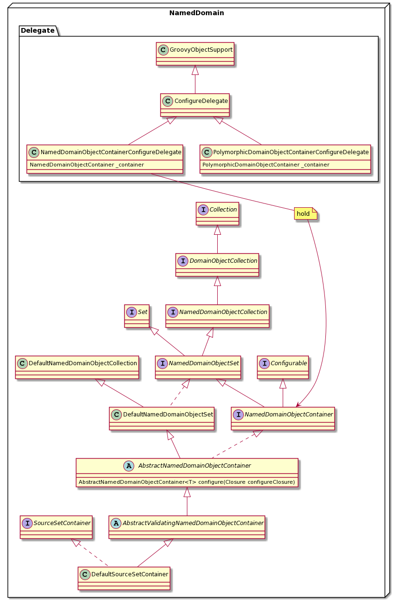
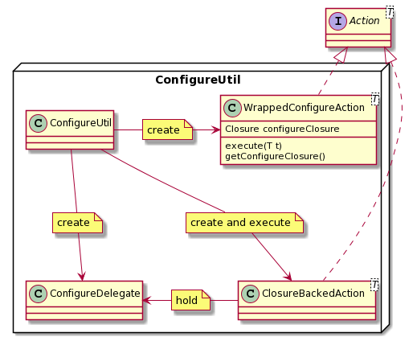

# Gradle 进阶 第九篇

学不可以已

## NamedDomainObjectContainer
这里一章会讨论 Gradle 中一个非常重要的概念 NamedDomainObjectContainer。它是一个命名对象领域容器，源码里的注释解释，NamedDomainObjectContainer 其实就是一个可以拥有创建单个 item 能力的 NamedDomainObjectSet。而 NamedDomainObjectSet 又是可以根据 item 名字来排列的一个集合，这个集合里的元素都是一个领域的对象，以不同的名字来区别，所以一个集合里的名字在一个领域里只能是惟一的。
我先展示一张类图来让大家直观的了解一下 NamedDomainObject 相关的一系列关系：

理解 NamedDomainObjectContainer 的字面意思比较容易，这里我就先用一个栗子来开始：

~~~
plugins {
    id 'java'
}

sourceSets {
  main {
    java {
      
    }
  }
  test {
    java{

    }
  }
  example {
    java{

    }
  }
}
~~~
上述栗子在 sourceSets 中创建了 main，test，example 三个 sourceSet，实际上在 JavaPlugin 被 apply 的时候，已经创建好了 main 和 test 两个 sourceSet，这里只是会去覆盖这两个 sourceSet 的配置。如下：
~~~
 -- JavaPlugin.java
  private void configureSourceSets(JavaPluginConvention pluginConvention, final BuildOutputCleanupRegistry buildOutputCleanupRegistry) {
        Project project = pluginConvention.getProject();
        SourceSetContainer sourceSets = pluginConvention.getSourceSets();

        SourceSet main = sourceSets.create(SourceSet.MAIN_SOURCE_SET_NAME);

        SourceSet test = sourceSets.create(SourceSet.TEST_SOURCE_SET_NAME);
        ...
    }
~~~
但是 example 是我们通过名字来创建了一个新的 sourceSet 对象。sourceSet 是逻辑上相关的一组 Java 代码以及资源文件的集合。这里就不继续讨论，主要借这个栗子来深入了解一下 NamedDomainObjectContainer。

sourceSets 的函数调用最终代理到了 SourceSetContainer 接口，它的实现类是 DefaultSourceSetContainer:
~~~
public class DefaultSourceSetContainer extends AbstractValidatingNamedDomainObjectContainer<SourceSet> implements SourceSetContainer{
    ...
     protected SourceSet doCreate(String name) {
        DefaultSourceSet sourceSet = instantiator.newInstance(DefaultSourceSet.class, name, objectFactory);
        sourceSet.setClasses(instantiator.newInstance(DefaultSourceSetOutput.class, sourceSet.getDisplayName(), fileResolver, fileCollectionFactory));
        return sourceSet;
    }
    ...

}
~~~
这里的 doCreate 就是就是通过传入一个 name 来创建一个 SourceSet 的实例。

## sourceSet 创建细节
现在我们深入分析一下源码，看看 sourceSets 代码块中的代码是如何创建的 main sourceSet。
~~~
sourceSets{
    main{
        java{

        }
    }
  ...
}
~~~
在第二章里讲过关于 Extension 先关的概念，这里就直接跳过，在 apply javaPlugin 之后，会被动的 apply JvmEcosystemPlugin，在JvmEcosystemPlugin 中有：
~~~
        p.getExtensions().add(SourceSetContainer.class, "sourceSets", sourceSets);
~~~
我们看到 SourceSetContainer 以 "sourceSets" 这个名字被加入了项目的约定群中。因此 sourceSets{} //surceSets(Closure closure)// 函数调用会通过 DefaultConvent 的 configureExtension 函数调用到 ExtensionsStorage 的 configureExtension 方法中来。这个细节在系列文章的第三篇中有讲。
~~~
    private Object configureExtension(String name, Object[] args) {
        Closure closure = (Closure) args[0];
        Action<Object> action = ConfigureUtil.configureUsing(closure);
        return extensionsStorage.configureExtension(name, action);
    }
~~~
~~~
 public <T> T configureExtension(String name, Action<? super T> action) {
        ExtensionHolder<T> extensionHolder = uncheckedCast(extensions.get(name));
        if (extensionHolder != null) {
            return extensionHolder.configure(action);
        }
        throw unknownExtensionException(name);
    }
~~~
这里截一张图来印证：

接下来有一点需要强调，在 Gradle 的 DSL 世界中，一个函数调用如果参数是闭包，一般都会调用 ConfigureUtil 这个类来进行配置。其中有一个非常重要的类：
~~~
public static <T> T configure(@Nullable Closure configureClosure, T target) {
        if (configureClosure == null) {
            return target;
        }

        if (target instanceof Configurable) {
            ((Configurable) target).configure(configureClosure);
        } else {
            configureTarget(configureClosure, target, new ConfigureDelegate(configureClosure, target));
        }

        return target;
    }
~~~
这里会判断如果传入的 target 即需要配置的类是可以配置的，就直接调用该类的 configure 方法，如果这个 target 不是可配置的，那就会给这个 target 创建一个配置代理来配置。
在这里 SourceSetContainer 的实现类 DefaultSourceSetContainer 继承自
AbstractNamedDomainObjectContainer 是可配置的，所以调用该类的 configure 函数。
~~~
    @Override
    public AbstractNamedDomainObjectContainer<T> configure(Closure configureClosure) {
        ConfigureDelegate delegate = createConfigureDelegate(configureClosure);
        ConfigureUtil.configureSelf(configureClosure, this, delegate);
        return this;
    }
~~~ 
在这个函数中首先调用 createConfigureDelegate 来创建配置代理。然后通过调用 ConfigureUtil 的 configureSelf 函数，传入闭包(即配置的参数)，以及配置代理来进行配置。会调用下面这个方法：
~~~
class ConfigureDelegate extends GroovyObjectSupport {
  ...
  @Override
    public Object invokeMethod(String name, Object paramsObj) {
       ...
       
          result = _configure(name, params);
       ...        
    }
}
~~~
这里的 ConfigureDelegate 实际是 NamedDomainObjectContainerConfigureDelegate:
~~~
class NamedDomainObjectContainerConfigureDelegate extends ConfigureDelegate {
    ...
    @Override
    protected DynamicInvokeResult _configure(String name, Object[] params) {
        if (params.length == 1 && params[0] instanceof Closure) {
            return DynamicInvokeResult.found(_container.create(name, (Closure) params[0]));
        }
        return DynamicInvokeResult.notFound();
    }
}
~~~
其中有一点重要的是 _configure 中实际调用 _container.create(name, (Closure) params[0])，调用了 DefaultSourceSetsContainer 基类的 create 方法。
~~~
abstract class AbstractNamedDomainObjectContainer<T> extends DefaultNamedDomainObjectSet<T> implements NamedDomainObjectContainer<T>, HasPublicType {
    ...
    @Override
    public T create(String name, Action<? super T> configureAction) throws InvalidUserDataException {
        assertMutable("create(String, Action)");
        assertCanAdd(name);
        T object = doCreate(name);
        add(object);
        configureAction.execute(object);
        return object;
    }
    ...
}
~~~
最终调用到 DefaultSourceSetsContainer 的 doCreate 方法。
~~~
    @Override
    protected SourceSet doCreate(String name) {
        DefaultSourceSet sourceSet = instantiator.newInstance(DefaultSourceSet.class, name, objectFactory);
        sourceSet.setClasses(instantiator.newInstance(DefaultSourceSetOutput.class, sourceSet.getDisplayName(), fileResolver, fileCollectionFactory));
        return sourceSet;
    }
~~~
通过这个栗子的解析，我们就能看到 NamedDomainObjectContainer 是如何通过闭包来创建并配置其内部的单个项的。

## NameDomainObjectContainer 总结

总的流程就是：
1. 先找到对应的 NamedDomainObjectContainer, 就像 SourceSets 的栗子中， SourceSetsContainer 是在 apply 相关的 plugin 的时候，通过添加 extension 的方式，把脚本里的 SourceSets{} 映射到 SourceSetsContainer。
2. 然后创建相应的 ConfigureDelegate 即 NamedDomainObjectContainerConfigureDelegate 。
3. 然后通过 ConfigureUtil 类的 configure 方法通过传入的闭包以及名字来创建并配置一个领域相关的项。就像 SourceSets 的栗子 SourceSets{ main{}}，创建了一个名字为 main 的 SourceSet。

提到 ConfigureUtil， 这里就把 ConfigureUtil 解析一下：

~~~
  class ConfigureUtil{
    public static <T> T configureByMap(Map<?,?> properties,T delegate){...}

    public static <T> T configureByMap(Map<?, ?> properties, T delegate, Collection<?> mandatoryKeys) {...}

    public static <T> T configure(@Nullable Closure configureClosure, T target) {...}

    public static <T> Action<T> configureUsing(@Nullable final Closure configureClosure) {...}

    public static <T> T configureSelf(@Nullable Closure configureClosure, T target) {...}

    public static <T> T configureSelf(@Nullable Closure configureClosure, T target, ConfigureDelegate closureDelegate) {...}

    private static <T> void configureTarget(Closure configureClosure, T target, ConfigureDelegate closureDelegate) {...}

  }
   
~~~
其中 configureByMap 方法调用的栗子是：apply plugin:"java-library" 或者 fileTree(dir: 'libs', include: ['*.jar', '*.aar'])。

而 configure configureSelf configureUsing 这三个函数，最终都会调用 configureTarget 来作真正的 configure：
~~~
private static <T> void configureTarget(Closure configureClosure, T target, ConfigureDelegate closureDelegate) {
        if (!(configureClosure instanceof GeneratedClosure)) {
            new ClosureBackedAction<T>(configureClosure, Closure.DELEGATE_FIRST, false).execute(target);
            return;
        }

        // Hackery to make closure execution faster, by short-circuiting the expensive property and method lookup on Closure
        Closure withNewOwner = configureClosure.rehydrate(target, closureDelegate, configureClosure.getThisObject());
        new ClosureBackedAction<T>(withNewOwner, Closure.OWNER_ONLY, false).execute(target);
    }
~~~
我在这里画了一幅类图：

里面有两个重要的 Action ： ClosureBackedAction 和 WrappedConfigureAction。

ClosureBackedAction
~~~
public class ClosureBackedAction<T> implements Action<T> {
...

    public static <T> void execute(T delegate, Closure<?> closure) {
        new ClosureBackedAction<T>(closure).execute(delegate);
    }

    @Override
    public void execute(T delegate) {
        if (closure == null) {
            return;
        }

        try {
            if (configurableAware && delegate instanceof Configurable) {
                ((Configurable) delegate).configure(closure);
            } else {
                Closure copy = (Closure) closure.clone();
                copy.setResolveStrategy(resolveStrategy);
                copy.setDelegate(delegate);
                if (copy.getMaximumNumberOfParameters() == 0) {
                    copy.call();
                } else {
                    copy.call(delegate);
                }
            }
        } catch (groovy.lang.MissingMethodException e) {
            if (Objects.equal(e.getType(), closure.getClass()) && Objects.equal(e.getMethod(), "doCall")) {
                throw new InvalidActionClosureException(closure, delegate);
            }
            throw e;
        }
    }
  ...
}

~~~

WrappedConfigureAction
~~~
public static class WrappedConfigureAction<T> implements Action<T> {
        private final Closure configureClosure;

        WrappedConfigureAction(Closure configureClosure) {
            this.configureClosure = configureClosure;
        }

        @Override
        public void execute(T t) {
            configure(configureClosure, t);
        }

        public Closure getConfigureClosure() {
            return configureClosure;
        }
    }
~~~
其中 ClosureBackedAction 的 execute 方法里判断如果 delegate 是可配置的，就会直接调用 configure 方法并且把闭包以参数形式传入。否则将会把 delegate 设置成为闭包的代理，然后调用闭包的 call 方法。